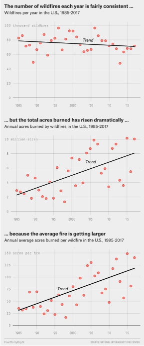
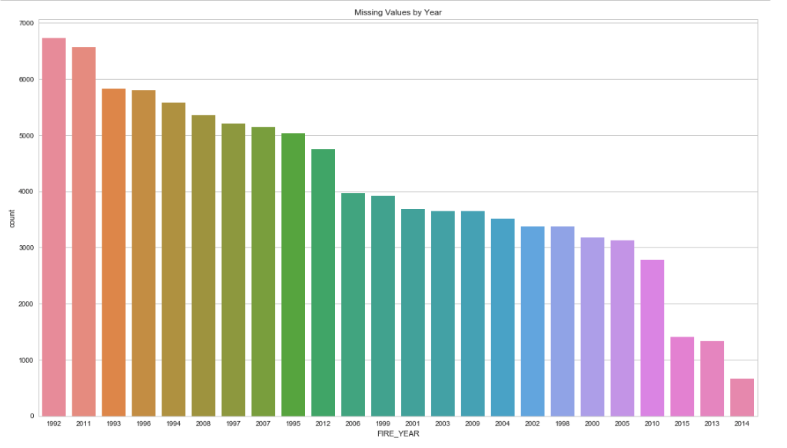
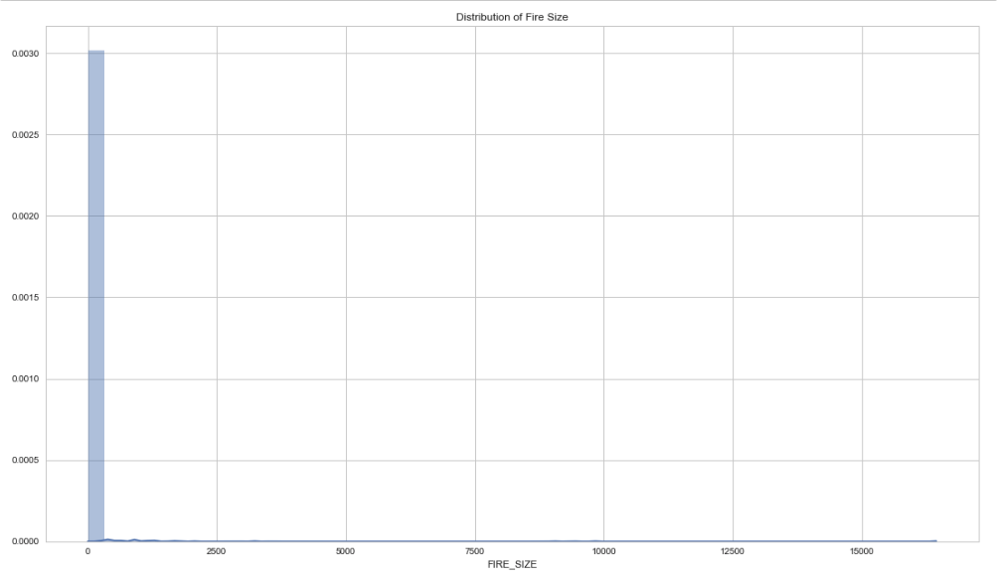
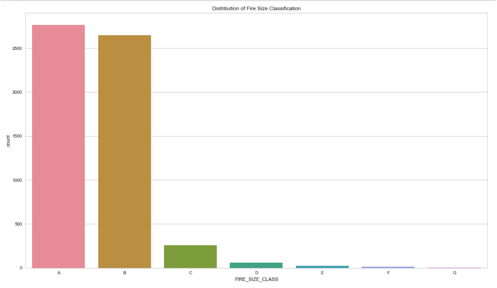
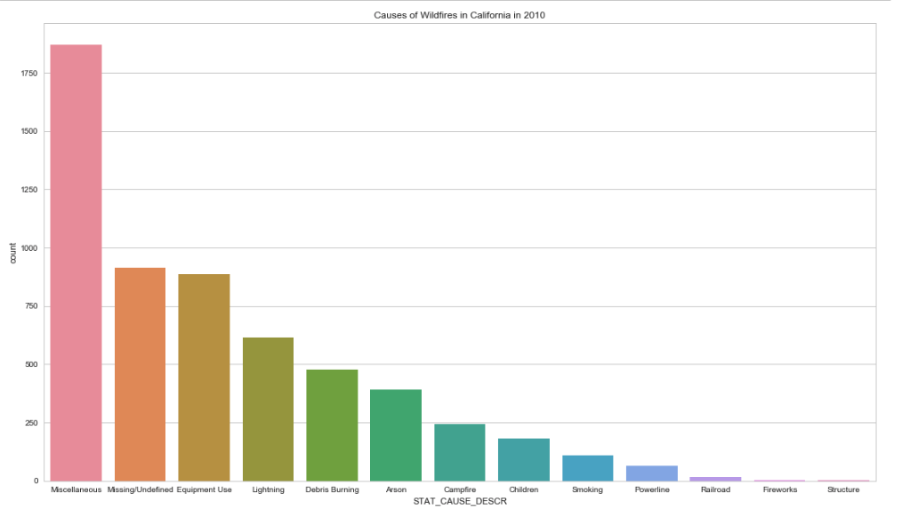
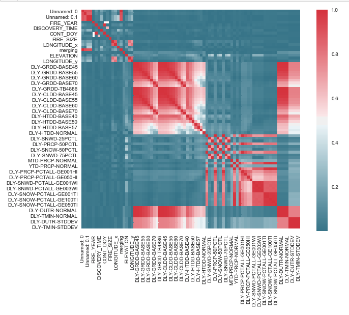

# Abstract

# Introduction:
Recent media coverage seems to echo the nation's growing concern over the impact of wild fires. Cumulatively, the top 10 fires in California have set aflame to millions of acres and damages thousands of structures.1 Depending on their location, some of the larger California wild fires have claimed the lives of dozens. In mid-November of 2018, the _Camp Fire_ in northern California killed 85 people.2,6 The alarming death tolls alone provide enough reason to attempt to predict the potential impact of wild fires. Environmental and economic damages are also a concern for homeowners, residents, insurers, governments, and nearby communities. For these reasons, it is no surprise that efforts to predict the behavior and effects of wildfires have already been made.

A 2016 report by the U.S. Fire Administration shows a general decrease in fire-related death trend.3 This could be attributed to advancements in predictive and preventative technology, medical technology and techniques, or safer construction regulations/guidelines. However, previous attempts at predicting the behavior of wildfires have suffered from a lack of funding. This means that the practical applications of the models described in literature are lacking.4 Additionally, much of this research (and it's associated models) pre-dates the scientific research showing that "wildfire activity increased suddenly and markedly in the mid-1980s, with higher large-wildfire frequency, longer wildfire durations, and longer wildfire seasons." — In fact, wildfire activity in the Western United States forests is thought to have increased in recent decades due to "increased spring and summer temperatures and an earlier spring snowmelt."5

_The devastating and unpredictable nature of wildfires puts the lives of thousands of homeowners, firefighters, respondents, at risk._

In tandem, an article by FiveThirtyEight in the summer of 2018 reported, "Wildfires In The U.S. Are Getting Bigger." Accompanied with the article were a series of graphics, visible below.

These graphics tell us a scary story, where the size of the fire is becoming more and more important as each fire is more dangerous than the one before.

The purpose of this project is to better predict the size of wildfires in California. Due to the changing climate, the problems caused by wildfires in the western United States and California specifically are more pertinent than ever.5 Accurate prediction models will allow communities to evacuate individuals and families at the appropriate time and place. As visible from the graphics above, it is imperative to solve this issue. This project limits the scope of the models to California wildfires, but the features used by the model are not specific the region. These models and techniques could be applied to any geographical locations that experience wildfires, assuming similar data is attainable. Models or technologies that provide accurate information regarding where and when to deploy containment efforts will have the potential to save hundreds, if not thousands, of lives.

1. https://www.iii.org/fact-statistic/facts-statistics-wildfires
2. https://www.theguardian.com/us-news/video/2018/nov/13/camp-fire-deadliest-wildfire-california-history-video-report
3. https://www.usfa.fema.gov/data/statistics/fire_death_rates.html
4. https://www.fs.fed.us/rm/pubs_series/int/gtr/int_gtr030.pdf
5. http://science.sciencemag.org/content/313/5789/940
6. https://www.usatoday.com/story/news/2018/12/03/camp-fire-death-toll-california-deadliest-wildfire/2199035002/
7. https://fivethirtyeight.com/features/wildfires-in-the-u-s-are-getting-bigger/

# Related Work:

# Methods:
As outlined before, the problem we selected to address was the rapid increase in size of extreme wildfires. We decided to approach the problem by leveraging past data to try and predict the size of the wildfire.

In order to address the problem at hand, we broke the process down into 4 major steps: __Data Selection__, __Data Cleaning and Preparation, __Feature Selection__, __Insights from Exploration__, and __Modeling__.

## Data Selection:
Our first step in our process was to find a dataset that we felt contained features and values that we felt would be beneficial. Heavy discussion went into deciding the data that would be most valuable to a model such as this one. With the obvious effects of weather and climate data on the size, spread, and impact of wildfires, it was evident that we should get some sort of climate data in tandem with historical fire data with information on size, locations, and other factors that are important to predict. However, after struggling to find data that was consistent across multiple locations, we decided that it would be sufficient to solely use California data in order to build the model out. We ultimately ended up selecting two separate data sets:

Our primary [data source](https://www.fs.usda.gov/rds/archive/Product/RDS-2013-0009.4/) for wildfire related data contains records of 1.88 Million U.S. wildfires from the United States Department of Agriculture's Forest Service. This data publication contains a spatial database of wildfires that occurred in the United States from 1992 to 2015. It is the third update of a publication originally generated to support the national Fire Program Analysis (FPA) system. The wildfire records were acquired from the reporting systems of federal, state, and local fire organizations.

To supplement our models, we also used California climate data that was [requested](https://www.ncdc.noaa.gov/cdo-web/orders?email=skharb@uw.edu&id=1562545) from NOAA. This curated dataset contains various features related to temperature, precipitation, humidity, snowfall, and other climate variables for California in 2010.

## Data Cleaning and Preparation:
After we had selected our data, we faced the monumental challenge of combining the two datasets and then further preparing the data for the model. With regards to the combination of the disparate datasets, there were 3 mutual columns that we leveraged to join our data sets: Latitude, Longitude, and Date. However, it was quickly evident that the process would not be as easy as it seemed as longitude and latitude coordinates for the fire location and the climate data would never be exactly the same. In order to combat this, we developed a method of finding the longitude and latitude location representing the climate location closest to the wildfire's location using a buffer on each coordinate to increase chance of overlap of the coordinates.

Once the two datasets were combined, we were tasked with dealing with a series of missing values. Missing values are scattered (mostly) randomly throughout the dataset with the exception of certain climate variables, some of which contain mostly missing values. These missing values could impact the statistical models if they mask any correlation. One option we considered to handle these was to remove rows with missing values entirely. However, while this would be simple and make the data as pure as possible, this would result in most of our rows being deleted and would not allow for sufficient data to develop our model on. As long as an insignificant portion of the rows contain missing values, the models should not be affected dramatically. In an effort to maximize our effective data and to limit the scope of the project, we used a subset of the dataset that had sufficient data. Some years have a higher proportion of missing values, which can be seen below.

A number of the features in the original wildfire dataset could be used as predictor variables, as lat/long coordinates, county, time of year, while others were effectively different ways of identifying fires (multiple ID's). We removed additional identifier columns, as well as columns that did not have pertinent information. Part of our research question is to determine whether there is a correlation between climate variables and fire size. Specifically, wanted to see how temperature, precipitation, and humidity affect fire size, as well as any other climate features that can be accessed.

Since we were able to get geographical climate data for 2010, and since 2010 had relatively few missing values, we only used the 2010 subset of wildfire data. After that, we used recursive feature elimination (RFE) to determine the most effective set of features. Then, we cross-referenced the top features with the set of columns based on the proportion of missing values. Of the top features that were selected by RFE, the highest proportion of missing values was 0.22, so we removed climate features that had more than 25% missing values.

Finally, we were able to handle the rest of the missing values using forward fill. Since the remaining missing values were continuous climate variables scattered (mostly) randomly throughout the dataset without long streaks, this method of handling missing values was appropriate.

## Feature Selection:
As touched on briefly previously, in order to adequately manage such a big dataset as well as run our model as efficiently and accurately as possible, we ran a feature selection model to determine which features are most pertinent and relevant. Given the clean dataset, we then ran a recursive feature elimination algorithm using a RandomForestClassifier as the base model to determine give us a list of the top ten features.

From the results, we empirically selected a couple of features that made the most practical impact from a humanistic standpoint and model standpoint, and continued on to modeling.

## Insights from Exploration:
Once we had cleaned and prepared data, it was finally time to start implementing our model. Before we did so, there were a couple of important insights to gain from our exploration of our data:

Fire size is presented in two ways in our dataset: FIRE_SIZE describes the continuous size in acreage while FIRE_SIZE_CLASS categorizes the fire on a scale from 'A' to 'G', where 'A' classifies the smallest fires and 'G' being attributed to the largest fires. Here is a breakdown of how wildfires are classified based on acreage:

'A' = '0-0.25 acres'
'B' = '0.26-9.9 acres '
'C' = '10.0-99.9 acres'
'D' = '100-299 acres'
'E' = '300-999 acres'
'F' = '1000-4999 acres'
'G' = '5000+ acres'

For this project, we decided to focus on a classifying model to predict the category that a fire might fall into based on pertinent variables. Due to the highly (left) skewed distribution of continuous wildfire size data, a regression model would be more difficult to interpret. The classification scale takes the logarithmic distribution into account and will lead to a more interpretable model. Below are two separate plots, depicting the visible difference between FIRE_SIZE and FIRE_SIZE_CLASS.

From these two distributions, we can see that the categorical size is significantly more interpretable because the categories are logarithmic and take the original distribution into account. We can also make insights based on these distributions: most wildfires can be categorized as 'A' or 'B' fires. This means that relatively larger fires (class 'C' and above, in this case) only occur in a fraction of wildfire incidents. If the relatively few larger fires correlate with the environmental variables that we have provided, then an accurate and interpretable model can also be produced.

In addition to climate variables, we predicted that the cause of a fire might be a predictor for fire size and impact. _What are the causes of the most dangerous fires?_

Shown below is a distribution of wildfire causes.

Contrary to our original hypothesis, the most frequent (known) causes of wildfires are equipment use and lightning while the least frequent causes are structure fires and fireworks. However, we want to know which of these result in the most damaging (or largest) fires.

In addition to the aforementioned feature selection, we used a correlation matrix to visualize which climate and fire variables have a strong correlation with fire size, as seen below.

While many of the climate variables correlate to each other (which is to be expected), there is relatively little correlation with fire size, meaning that our climate variables have a low chance of providing a rigorous model. If this is the case, it will be revealed by the accuracy of our models.

## Modeling:
Given these insights, it was finally time for us to implement models to try and predict the size of a wildfire. Our decision to use the Random Forest Classifier and the Gradient Booster Classifier was guided by the SciKit-learn documentation. Following [this](https://scikit-learn.org/stable/_static/ml_map.png) graphic, we landed on the decision to use SVC or Ensemble Classifiers, through which we ultimately ended up on Gradient Booster Classifier and Random Forest Classifier.

##### Random Forest Classifier:
We started with the Random Forest classifier. For each model, the process was similar. We began with a simple grid search to determine the best parameters to use in our model, and leveraging the results from the grid search, we trained the model.

##### Gradient Booster Classifier:
A similar process was conducted for the Gradient Booster classifier, where we ran a grid search and leveraged the results to train the model.

# Results:
Upon finalizing our models and testing their accuracy, we were disappointed to see the outcome. The accuracy for the Random Forest Model was a dismal, __0.6343__, with the Gradient Booster scoring a similar,
__0.6295__.

# Discussion:
From the feeble results from our model, we were no doubt disappointed and conducted a bit of investigation into what could have gone wrong. Ultimately, we went back to stage 1 and observed the correlation matrix to visualize the strength of relationships between variables to determine if there was an issue in the data selection process.

While many of the climate variables correlate to each other (which is to be expected), there is relatively little correlation with fire size. This lack of correlation was evident through the accuracy (or lack thereof) of our model. This leads us to recognize that our fundamental flaw was not within the model or the model selection, but rather, the data selected had little correlation with the resulting features, thus it was unable to accurately predict anything of substance.

# Future Work:
